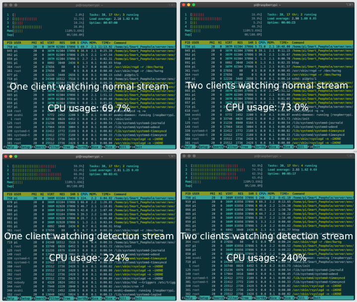

# Smart_Peephole

    
    <h3 align="center"><strong>Smart Peephole</strong></h3>

        <strong>Electronic door peephole running on Raspberry Pi, based on Flask framework. Through this web application, you can check who is at your door at any time.</strong>
         
    

 
 

    
    

        See who's on the staircase!
    

 
 

    
    

        Find the face of whoever stands in front of the door ... if you have a problem with that!
    

 
 

# Getting started
## Prerequisites
Make sure that you have the following:
* Raspberry Pi
* Camera module
* Micro SD card with Pi OS on it
* Installed Python3 Virtual Environments

 
I have used Raspberry Pi 4B 4GB, but Pi 3B should also work fine. Similar with the camera, yout can experiment with different models. I have used ArduCam OV5647 5Mpx with LS-40180 Fish Eye CS mount.
 
 

## Installing
Before doing anything please remember to change startup script (run.sh). Change `xxx.xxx.x.xxx:xxxx` to your raspberry ip address. You can find it via `ifconfig`. 

1. Install Python3 Virtual Environments (sudo pip3 install virtualenv)
2. Clone repo somewhere on your Pi.
3. Move into repo. (cd Smart_Peephole/)
4. Create virtual environment. (python3 -m venv server/env)
5. Activate virtual environment. (source server/env/activate)
6. Install needed python modules. (pip install -r requirements.txt)
7. Deactivate virtual environment. Won't need it anymore. (deactivate)
8. Make run script exacutable. (chmod +x run.sh)
 
 

## Starting
Startup script is starting virtual environment and launching whole app. You only need to launch it via `./run.sh`

 
It is also possible to run this app at startup of Pi. It can be done by modifying .bashrc file. Put the startup script call at the bottom of the mentioned file: run.sh
 
 

## Functionality
Main goal was to allow user to see live feed from camera mounted on door. Besides that SmartPeephole is able to do a couple more things:
* Detects face on live stream feed  (not face recognition)
* Allows to create accounts for multiple users and remembers their settings
* Allows users to create notes - photos from camera with description
 
 

## Logging into the application
When you log in with the following credentials -> __email:__ `admin@admin.pl` and __pw:__ `admin`, you will be able to access administrator side of the app. From this point you can create and delete accounts. Application forces you to login before allowing you to watch the stream.
 
 

## CPU usage

    

 
 

# Build with
* <a href="https://flask.palletsprojects.com/en/1.1.x/">Flask</a>
* <a href="https://opencv.org/">OpenCV</a>
* <a href="https://www.sqlite.org/index.html">SQLite</a>
